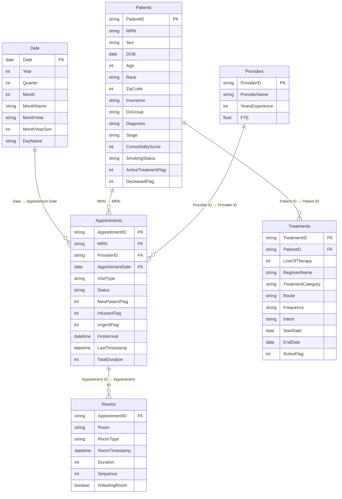
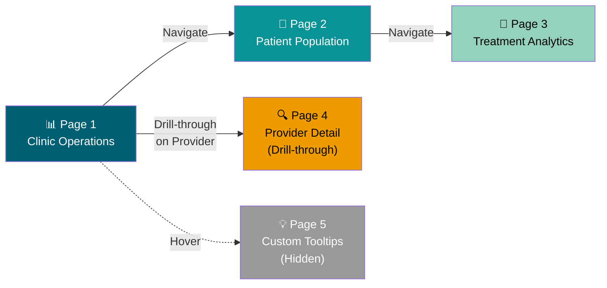
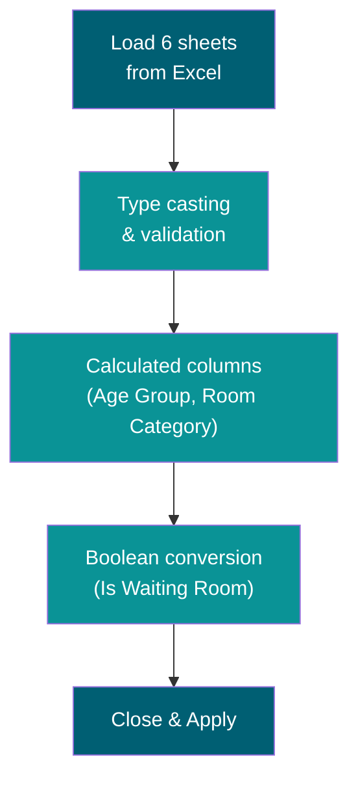
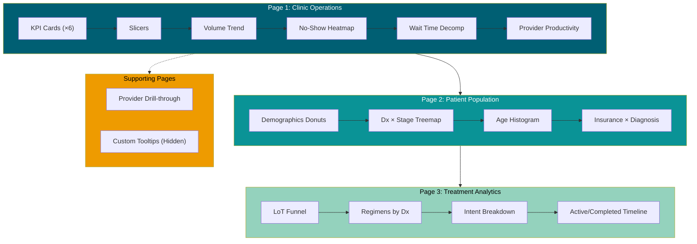
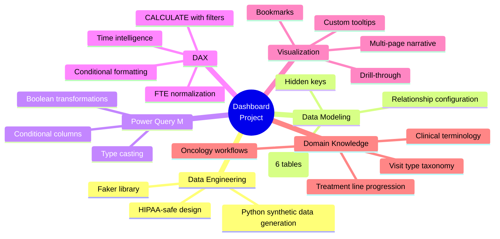

# Oncology Clinic Operations Dashboard — Power BI Blueprint

> **Portfolio Project** · Healthcare Data Analytics  
> **Dataset:** Synthetic outpatient oncology/hematology clinic data  
> **Scope:** 22,120 appointments · 3,600 patients · 6 providers · 133,795 room transitions · 3,289 treatment episodes  
> **Date Range:** July 2023 – March 2026

---

## 1 · Dataset Analysis

### 1.1 What This Data Represents

This is an **outpatient oncology and hematology clinic** dataset structured as a star schema. It captures the full lifecycle of a patient visit — from scheduling through room-level workflow transitions to checkout — alongside clinical context (diagnosis, staging, treatment regimens). The mix of Iron Deficiency Anemia (IDA) patients with solid tumor and hematologic malignancy patients mirrors a real-world community oncology/hematology practice.

### 1.2 Table Inventory

| Table | Rows | Grain | Role |
|---|---|---|---|
| **Appointments** | 22,120 | One row per scheduled appointment | Central fact table |
| **Rooms** | 133,795 | One row per room transition per appointment | Workflow detail fact table |
| **Patients** | 3,600 | One row per unique patient | Dimension |
| **Providers** | 6 | One row per clinician | Dimension |
| **Treatments** | 3,289 | One row per treatment episode | Fact / slow-changing dimension |
| **Date** | 1,461 | One row per calendar day (Jul 2023 – Jan 2026) | Date dimension |

### 1.3 Key Fields by Table

**Appointments**
- `Appointment ID` (PK), `MRN` (FK→Patients), `Provider ID` (FK→Providers)
- `Appointment Date` (FK→Date), `Visit Type`, `Status`
- Binary flags: `New Patient Flag`, `Infusion Flag`, `Urgent Flag`
- Timestamps: `First Arrival`, `Last Timestamp`
- `Total Duration` (minutes, null for non-completed)

**Patients**
- `Patient ID` (PK), `MRN` (natural key)
- Demographics: `Sex`, `DOB`, `Age`, `Race`, `Zip Code`
- Clinical: `Dx Group` (ida / malignant), `Diagnosis`, `Stage`, `Comorbidity Score`, `Smoking Status`
- Status: `Active Treatment Flag`, `Deceased Flag`
- `Insurance` (Commercial, Medicare, Medicaid, Self-Pay)

**Rooms**
- `Appointment ID` (FK→Appointments)
- `Room`, `Room Type` (Status / Exam Room / Infusion Room / Front Desk / Lab)
- `Room Timestamp`, `Room Time`, `Duration`, `Sequence`
- `Is Waiting Room` (text: "True" / "False")

**Treatments**
- `Treatment ID` (PK), `Patient ID` (FK→Patients)
- `Line of Therapy` (1 / 2 / 3), `Regimen Name`, `Treatment Category`
- `Route` (IV / Oral / Injection / None), `Frequency`, `Intent`
- `Start Date`, `End Date`, `Active Flag`

**Providers**
- `Provider ID` (PK), `Provider Name`, `years_experience`, `fte`

**Date**
- `Date` (PK), `Year`, `Quarter`, `Month`, `Month Name`, `Month Short`
- `Month Year`, `Month Year Sort`, `Day of Week`, `Day Name`

### 1.4 Key Statistical Observations

**Appointment Outcomes**

| Status | Count | Rate |
|---|---|---|
| Completed | 19,359 | 87.5% |
| Cancelled | 1,451 | 6.6% |
| No Show | 1,310 | 5.9% |

**No-Show Rate by Visit Type**

| Visit Type | No-Show Rate | Cancellation Rate | Combined Loss |
|---|---|---|---|
| New Patient | 7.3% | 6.7% | 14.0% |
| Follow-up | 6.9% | 7.0% | 13.9% |
| Lab Review | 6.9% | 6.6% | 13.5% |
| Urgent Visit | 6.2% | 7.3% | 13.5% |
| Infusion | 3.6% | 5.8% | 9.4% |

> **Insight:** Infusion visits have the lowest no-show rate (3.6%) — clinically expected since patients on active chemotherapy are highly motivated to attend. New Patient visits have the highest no-show rate (7.3%), representing the single largest scheduling optimization opportunity.

**Average Visit Duration by Type (Completed Only)**

| Visit Type | Avg Duration (min) | Volume |
|---|---|---|
| Infusion | 199.5 | 5,976 |
| New Patient | 85.6 | 2,742 |
| Urgent Visit | 45.2 | 1,206 |
| Follow-up | 44.3 | 6,835 |
| Lab Review | 33.3 | 2,600 |

**Average Wait Time by Location**

| Waiting Area | Avg Wait (min) | Observations |
|---|---|---|
| Infusion Waiting Room | 10.6 | 7,275 |
| Lab Waiting Room | 9.4 | 18,153 |
| Main Waiting Room | 8.7 | 19,359 |

**Patient Population**

| Attribute | Breakdown |
|---|---|
| Dx Group | IDA: 2,117 (59%) · Malignant: 1,483 (41%) |
| Top Diagnoses | IDA: 2,117 · Breast Ca: 266 · Lung Ca: 250 · Prostate Ca: 196 · Colorectal Ca: 193 |
| Insurance | Commercial: 46% · Medicare: 25% · Medicaid: 22% · Self-Pay: 6% |
| Sex | Female: 64% · Male: 36% |
| Age | Range: 17–90 · Mean: 52.9 |
| Active Treatment | 2,441 (68%) active · 1,159 (32%) inactive |
| Deceased | 46 (1.3%) |

**Treatment Patterns**

| Line of Therapy | Patients | Attrition |
|---|---|---|
| 1st Line | 2,768 | — |
| 2nd Line | 486 | 82% drop |
| 3rd Line | 35 | 93% drop from 2nd |

| Category | Count | Top Regimen |
|---|---|---|
| Supportive Therapy | 1,500 | Venofer (IV iron) |
| Chemo | 826 | Carboplatin/Pemetrexed, FOLFOX, R-CHOP |
| Targeted Therapy | 383 | Bevacizumab, Osimertinib, Herceptin/Perjeta |
| Observation | 265 | — |
| Hormonal Therapy | 189 | — |
| Immunotherapy | 126 | — |

### 1.5 Business Questions This Data Answers

1. How efficient is our clinic workflow? Where are the bottlenecks?
2. Which visit types and providers have the longest cycle times?
3. What drives no-shows and cancellations — and can we predict them?
4. How is provider capacity distributed relative to FTE?
5. What does our patient panel look like by diagnosis, stage, payer, and demographics?
6. Are treatment patterns consistent with expected line-of-therapy progression?
7. What is the throughput capacity of infusion bays vs. exam rooms?
8. Where should the clinic invest to improve patient experience?

---

## 2 · Semantic Data Model

### 2.1 Star Schema



### 2.2 Relationship Configuration

| From Table | From Column | To Table | To Column | Cardinality | Cross-Filter |
|---|---|---|---|---|---|
| Appointments | Appointment Date | Date | Date | Many-to-One | Single |
| Appointments | MRN | Patients | MRN | Many-to-One | Single |
| Appointments | Provider ID | Providers | Provider ID | Many-to-One | Single |
| Rooms | Appointment ID | Appointments | Appointment ID | Many-to-One | Single |
| Treatments | Patient ID | Patients | Patient ID | Many-to-One | Single |

> **Note:** All relationships use **single-direction** cross-filtering. Avoid bidirectional unless you have an explicit need — it introduces ambiguity and performance overhead in a model this size.

### 2.3 Columns to Hide from Report View

After building relationships, hide all foreign key columns from the report canvas to prevent analysts (or yourself) from accidentally using the wrong field:

- `Appointments[MRN]` — use `Patients[MRN]` instead
- `Appointments[Provider ID]` — use `Providers[Provider ID]` instead
- `Appointments[Appointment Date]` — use `Date[Date]` instead
- `Rooms[Appointment ID]` — navigate through Appointments
- `Treatments[Patient ID]` — use `Patients[Patient ID]` instead

---

## 3 · Dashboard Architecture

### 3.1 Page Flow



### 3.2 Page 1 — Clinic Operations Overview

This is the landing page. It answers: **"How is the clinic performing today?"**

```
┌──────────────────────────────────────────────────────────────────┐
│  ONCOLOGY CLINIC OPERATIONS DASHBOARD          Last Refresh: ... │
├──────────────────────────────────────────────────────────────────┤
│  [Date Range ▾]    [Provider ▾]    [Visit Type ▾]               │
├────────┬────────┬────────┬────────┬────────┬────────────────────┤
│  Total │ Comp.  │ No-Show│  Avg   │  Avg   │  Active           │
│  Appts │  Rate  │  Rate  │  Wait  │  Dur.  │  Patients         │
│ 22,120 │ 87.5%  │  5.9%  │ 9.3min │ 96.6min│  2,441            │
├────────┴────────┴────────┴────────┴────────┴────────────────────┤
│                                         │                       │
│  Appointment Volume Trend               │  No-Show Rate         │
│  (Stacked area: Completed /             │  Heatmap              │
│   No-Show / Cancelled by Month)         │  (Visit Type ×        │
│  ≈ 60% width                            │   Day of Week)        │
│                                         │  ≈ 40% width          │
├─────────────────────────────────────────┼───────────────────────┤
│                                         │                       │
│  Patient Wait Time Decomposition        │  Provider             │
│  (Stacked bar or waterfall:             │  Productivity         │
│   Waiting → Exam → Lab → Infusion       │  (Bar chart:          │
│   → Checkout by Visit Type)             │   Visits per FTE)     │
│  ≈ 60% width                            │  ≈ 40% width          │
│                                         │                       │
└─────────────────────────────────────────┴───────────────────────┘
```

**Visual Specifications:**

| # | Visual | Chart Type | Fields | Insight |
|---|---|---|---|---|
| 1 | KPI Cards (×6) | Card with conditional formatting | Measures (see §4) | Instant snapshot of clinic health |
| 2 | Appointment Volume Trend | Stacked area chart | X: `Date[Month Year]` · Y: Count of Appts · Legend: `Status` | Growth trajectory, seasonal patterns, status mix over time |
| 3 | No-Show Heatmap | Matrix with conditional formatting | Rows: `Visit Type` · Cols: `Date[Day Name]` · Values: `[No-Show Rate]` | Identifies high-risk day × visit type combinations for overbooking |
| 4 | Wait Time Decomposition | Stacked bar chart | X: `Visit Type` · Y: Avg Duration · Legend: `Room Type` segment | **Showstopper visual.** Reveals exactly where time is spent per visit type |
| 5 | Provider Productivity | Bar chart + reference line | X: `Provider Name` · Y: `[Visits per FTE]` · Line: Average | FTE-normalized comparison — fair benchmarking |

### 3.3 Page 2 — Patient Population Profile

Answers: **"Who are we serving?"**

```
┌──────────────────────────────────────────────────────────────────┐
│  [Dx Group ▾]    [Active Treatment ▾]    [Deceased ▾]           │
├────────────────┬────────────────┬────────────────┬──────────────┤
│   🍩 Diagnosis │  🍩 Insurance  │   🍩 Race /    │  🍩 Sex      │
│   Distribution │  Mix           │   Ethnicity    │  Split       │
├────────────────┴────────────────┴────────────────┴──────────────┤
│                                         │                       │
│  Diagnosis × Stage Treemap              │  Age Distribution     │
│  (Hierarchy: Dx Group → Diagnosis       │  Histogram            │
│   → Stage · Size = Patient Count)       │  (10-year bins)       │
│                                         │                       │
├─────────────────────────────────────────┼───────────────────────┤
│                                                                  │
│  Insurance × Diagnosis Stacked Bar                               │
│  (X: Diagnosis · Y: Count · Legend: Insurance)                   │
│                                                                  │
└──────────────────────────────────────────────────────────────────┘
```

| # | Visual | Chart Type | Fields | Insight |
|---|---|---|---|---|
| 6 | Diagnosis Distribution | Donut chart | `Patients[Diagnosis]`, Count | Panel composition at a glance |
| 7 | Insurance Mix | Donut chart | `Patients[Insurance]`, Count | Payer mix — revenue and access implications |
| 8 | Race/Ethnicity | Donut chart | `Patients[Race]`, Count | Health equity lens — critical in healthcare analytics |
| 9 | Sex Split | Donut chart | `Patients[Sex]`, Count | Expected skew (64% F) due to breast/ovarian cancers + IDA |
| 10 | Dx × Stage Treemap | Treemap | Hierarchy: `Dx Group` → `Diagnosis` → `Stage` · Size: Count | Clinical complexity — IDA dominates volume; malignant cases have stage stratification |
| 11 | Age Histogram | Histogram / grouped bar | `Patients[Age Group]` (calculated), Count | Age distribution drives care planning |
| 12 | Insurance × Diagnosis | Stacked bar | X: `Diagnosis` · Y: Count · Legend: `Insurance` | Reveals payer-diagnosis patterns (e.g., Medicare in prostate) |

### 3.4 Page 3 — Treatment Analytics

Answers: **"How are we treating them?"**

```
┌──────────────────────────────────────────────────────────────────┐
│  [Diagnosis ▾]    [Treatment Category ▾]    [Intent ▾]          │
├──────────────────────────────────────────────────────────────────┤
│                                                                  │
│  Treatment Line Funnel                                           │
│  (1st Line: 2,768 → 2nd Line: 486 → 3rd Line: 35)             │
│                                                                  │
├─────────────────────────────────────────┬───────────────────────┤
│                                         │                       │
│  Top Regimens by Diagnosis              │  Treatment Intent     │
│  (Stacked bar: X = Diagnosis ·          │  Breakdown            │
│   Y = Count · Legend = Regimen)         │  (Donut or 100% bar:  │
│                                         │   Curative /          │
│                                         │   Palliative /        │
│                                         │   Maintenance /       │
│                                         │   Supportive)         │
├─────────────────────────────────────────┼───────────────────────┤
│                                                                  │
│  Active vs. Completed Treatments Over Time                       │
│  (Area chart: X = Month · Y = Count · Legend = Active Flag)     │
│                                                                  │
└──────────────────────────────────────────────────────────────────┘
```

| # | Visual | Chart Type | Fields | Insight |
|---|---|---|---|---|
| 13 | Line of Therapy Funnel | Funnel chart | `Treatments[Line of Therapy]`, Count | Treatment attrition — 82% drop 1st→2nd, 93% drop 2nd→3rd |
| 14 | Regimens by Diagnosis | Stacked bar | X: `Diagnosis` · Y: Count · Legend: `Regimen Name` (top 10) | Treatment pattern validation — do regimens align with standards of care? |
| 15 | Treatment Intent | Donut / 100% stacked bar | `Treatments[Intent]`, Count | Curative vs. palliative mix — acuity signal |
| 16 | Active vs. Completed Timeline | Area chart | X: `Date[Month Year]` · Y: Count · Legend: `Active Flag` | Active panel growth over time |

### 3.5 Page 4 — Provider Detail (Drill-through)

Accessed by right-clicking any provider name on Page 1. Shows:
- Provider name, years of experience, FTE as a header
- Their personal KPIs (volume, no-show rate, avg duration)
- Visit type breakdown (donut)
- Monthly volume trend (line)
- Their top 10 diagnoses (bar)
- Their wait time decomposition (stacked bar)

### 3.6 Page 5 — Custom Tooltips (Hidden)

A hidden page sized to Tooltip dimensions. When the user hovers on a bar in the volume trend chart, the tooltip shows:
- Visit type breakdown for that month (mini donut)
- Completion rate for that month
- Avg wait time for that month

---

## 4 · DAX Measures

Create a dedicated **_Measures** table (enter a blank table, name it `_Measures`, delete the default column after adding measures). The underscore prefix sorts it to the top of the field list.

### 4.1 Core KPIs

```dax
Total Appointments = 
COUNTROWS(Appointments)


Completion Rate = 
DIVIDE(
    COUNTROWS(FILTER(Appointments, Appointments[Status] = "Completed")),
    COUNTROWS(Appointments),
    0
)


No-Show Rate = 
DIVIDE(
    COUNTROWS(FILTER(Appointments, Appointments[Status] = "No Show")),
    COUNTROWS(Appointments),
    0
)


Cancellation Rate = 
DIVIDE(
    COUNTROWS(FILTER(Appointments, Appointments[Status] = "Cancelled")),
    COUNTROWS(Appointments),
    0
)


Avg Wait Time = 
CALCULATE(
    AVERAGE(Rooms[Duration]),
    Rooms[Is Waiting Room] = TRUE
)


Avg Duration Completed = 
CALCULATE(
    AVERAGE(Appointments[Total Duration]),
    Appointments[Status] = "Completed"
)


Active Patients = 
COUNTROWS(
    FILTER(Patients, Patients[Active Treatment Flag] = 1)
)
```

### 4.2 Provider Productivity

```dax
Visits per FTE = 
VAR _months = DISTINCTCOUNT('Date'[Month Year Sort])
VAR _fte = SELECTEDVALUE(Providers[fte], 1)
VAR _visits = COUNTROWS(Appointments)
RETURN
    DIVIDE(_visits, _fte * _months, 0)


Avg Duration by Provider = 
CALCULATE(
    AVERAGE(Appointments[Total Duration]),
    Appointments[Status] = "Completed"
)
```

### 4.3 Time Intelligence

```dax
Appts MoM Change = 
VAR _current = COUNTROWS(Appointments)
VAR _prior = 
    CALCULATE(
        COUNTROWS(Appointments),
        DATEADD('Date'[Date], -1, MONTH)
    )
RETURN
    DIVIDE(_current - _prior, _prior, 0)


Appts YoY Change = 
VAR _current = COUNTROWS(Appointments)
VAR _prior = 
    CALCULATE(
        COUNTROWS(Appointments),
        DATEADD('Date'[Date], -1, YEAR)
    )
RETURN
    DIVIDE(_current - _prior, _prior, 0)


Rolling 3M Avg Appts = 
CALCULATE(
    DIVIDE(COUNTROWS(Appointments), 3),
    DATESINPERIOD('Date'[Date], MAX('Date'[Date]), -3, MONTH)
)
```

### 4.4 Conditional Formatting

```dax
NoShow Color = 
IF(
    [No-Show Rate] > 0.07, "#AE2012",
    IF([No-Show Rate] > 0.05, "#EE9B00", "#005F73")
)


Wait Time Color = 
IF(
    [Avg Wait Time] > 15, "#AE2012",
    IF([Avg Wait Time] > 10, "#EE9B00", "#005F73")
)
```

### 4.5 Display Formatting

```dax
Last Refresh = 
"Last updated: " & FORMAT(NOW(), "MMM DD, YYYY h:mm AM/PM")
```

---

## 5 · Design Recommendations

### 5.1 Color Palette


- Use **Deep Teal** for primary data series, headers, positive KPIs
- Use **Gold** for warnings (no-show rate 5–7%, wait time 10–15 min)
- Use **Coral** for alerts (no-show rate >7%, wait time >15 min)
- Use **Sage** for secondary data series and backgrounds
- Neutral grays (`#E0E0E0`, `#F5F5F5`) for gridlines and card backgrounds
- **Accessibility:** Maintain 4.5:1 minimum contrast ratio. Validate with [Coblis](https://www.color-blindness.com/coblis-color-blindness-simulator/).

### 5.2 Typography

| Element | Font | Size | Weight | Color |
|---|---|---|---|---|
| Card values | Segoe UI | 28–32pt | Bold | `#005F73` or conditional |
| Card labels | Segoe UI | 10–12pt | Regular | `#666666` |
| Chart titles | Segoe UI | 14pt | Semibold | `#333333` |
| Axis labels | Segoe UI | 10pt | Regular | `#666666` |
| Dashboard title | Segoe UI | 20pt | Bold | `#005F73` |

- No ALL CAPS titles
- Left-align text, right-align numbers — always
- Format percentages to one decimal (`0.0%`), durations with suffix (`## min`)

### 5.3 Theme JSON

Create a `.json` theme file and import it via View → Themes → Browse for Themes:

```json
{
  "name": "Oncology Clinic",
  "dataColors": [
    "#005F73", "#0A9396", "#94D2BD", "#EE9B00",
    "#AE2012", "#001219", "#CA6702", "#BB3E03"
  ],
  "background": "#FFFFFF",
  "foreground": "#333333",
  "tableAccent": "#005F73",
  "visualStyles": {
    "*": {
      "*": {
        "border": [{ "color": { "solid": { "color": "#FFFFFF" } } }]
      }
    }
  }
}
```

### 5.4 Interactive Elements

| Element | Implementation | Purpose |
|---|---|---|
| Date range slicer | Between slicer on `Date[Date]` | Filter all pages |
| Provider dropdown | Dropdown slicer on `Providers[Provider Name]` | Focus on individual clinician |
| Visit Type buttons | Chiclet / button slicer on `Appointments[Visit Type]` | Quick filtering by visit type |
| Dx Group toggle | Button slicer: "All" / "IDA" / "Malignant" | Separate clinical populations |
| Drill-through | Right-click Provider → Drill to Provider Detail page | Deep dive per clinician |
| Custom tooltips | Hidden tooltip page, referenced in volume trend | Contextual micro-dashboard on hover |
| Bookmarks | "Infusion Focus" / "New Patient Focus" presets | Demonstrates user-driven navigation |
| Page navigation | Icon buttons → page navigation action | Replace default tab strip |

### 5.5 Visual Best Practices

- Remove all chart borders and unnecessary gridlines
- Use data bars inside matrix visuals instead of raw numbers
- Sort bar charts by value, not alphabetically
- Apply the `Sort Month Year by Month Year Sort` column trick
- Keep donut charts to ≤6 categories (group the rest as "Other")
- No 3D charts. No pie charts with >4 slices. No rainbow palettes.
- Use report-level filters to exclude incomplete months (Mar 2023 ramp-up, Mar 2026 partial)

---

## 6 · Implementation Steps

### 6.1 Phase 1 — Data Preparation (Power Query)



| Step | Table | Action |
|---|---|---|
| 1 | All | Load all 6 sheets as separate queries |
| 2 | Appointments | Confirm `Appointment Date` = Date, `First Arrival` / `Last Timestamp` = DateTime, `Total Duration` = Whole Number |
| 3 | Appointments | Verify flag columns (New Patient, Infusion, Urgent) are 0/1 integers |
| 4 | Rooms | Cast `Is Waiting Room` from text to Boolean: `= if [Is Waiting Room] = "True" then true else false` |
| 5 | Rooms | `Duration` → Whole Number |
| 6 | Rooms | Add `Room Category` column: `if Text.StartsWith([Room], "Exam") then "Exam Room" else if Text.StartsWith([Room], "Infusion Bay") then "Infusion Bay" else [Room]` |
| 7 | Patients | `Age` → Whole Number, `Comorbidity Score` → Whole Number |
| 8 | Patients | Add `Age Group` column: `if [Age] < 30 then "18-29" else if [Age] < 50 then "30-49" else if [Age] < 65 then "50-64" else "65+"` |
| 9 | Treatments | Verify `Start Date` / `End Date` = Date, `Line of Therapy` = Whole Number |
| 10 | Date | Verify `Month Year Sort` is numeric; sort `Month Year` column by `Month Year Sort` |
| 11 | Providers | Verify `fte` = Decimal Number |

### 6.2 Phase 2 — Data Model

| Step | Action |
|---|---|
| 12 | Create relationship: `Appointments[Appointment Date]` → `Date[Date]` (M:1) |
| 13 | Create relationship: `Appointments[MRN]` → `Patients[MRN]` (M:1) |
| 14 | Create relationship: `Appointments[Provider ID]` → `Providers[Provider ID]` (M:1) |
| 15 | Create relationship: `Rooms[Appointment ID]` → `Appointments[Appointment ID]` (M:1) |
| 16 | Create relationship: `Treatments[Patient ID]` → `Patients[Patient ID]` (M:1) |
| 17 | Set all relationships to single-direction cross-filtering |
| 18 | Mark `Date` table as Date Table (Table Tools → Mark as Date Table → `Date[Date]`) |
| 19 | Hide foreign key columns from report view (see §2.3) |
| 20 | Create `_Measures` table |

### 6.3 Phase 3 — DAX Measures

| Step | Measures | Reference |
|---|---|---|
| 21 | Core KPIs: Total Appointments, Completion Rate, No-Show Rate, Cancellation Rate, Avg Wait Time, Avg Duration Completed, Active Patients | §4.1 |
| 22 | Provider: Visits per FTE, Avg Duration by Provider | §4.2 |
| 23 | Time Intelligence: MoM Change, YoY Change, Rolling 3M Avg | §4.3 |
| 24 | Conditional Formatting: NoShow Color, Wait Time Color | §4.4 |
| 25 | Display: Last Refresh | §4.5 |

### 6.4 Phase 4 — Build Visuals



| Step | Action | Notes |
|---|---|---|
| 26 | Build Page 1 KPI cards | Anchor the page; use as reference while building everything else |
| 27 | Add slicers (Date, Provider, Visit Type) | Test cross-filtering immediately |
| 28 | Volume trend area chart | Verify Date table relationship and Month Year sort order |
| 29 | No-show heatmap matrix | Add conditional formatting with `NoShow Color` measure |
| 30 | Wait time decomposition | Hardest visual — aggregate `Rooms[Duration]` by `Room Type` per `Visit Type`. Consider a pre-aggregated Power Query step or calculated table |
| 31 | Provider productivity bar chart | Add average reference line |
| 32 | Build Page 2 demographics | Donuts, treemap, histogram, stacked bar |
| 33 | Build Page 3 treatments | Funnel, stacked bars, timeline |
| 34 | Build Provider drill-through page | Configure drill-through field = `Providers[Provider Name]` |
| 35 | Build custom tooltip page | Set page size to Tooltip; add micro-visuals |

### 6.5 Phase 5 — Polish

| Step | Action |
|---|---|
| 36 | Import JSON theme file |
| 37 | Replace default visual titles with text boxes (better typographic control) |
| 38 | Add dashboard header: title, `[Last Refresh]` measure, logo placeholder |
| 39 | Create bookmarks: "Infusion Focus", "New Patient Focus" |
| 40 | Add page navigation buttons with icons |
| 41 | Configure mobile layout (View → Mobile Layout) |
| 42 | Remove unnecessary gridlines, borders, backgrounds |
| 43 | Ensure all number formats are consistent |

### 6.6 Phase 6 — Validate

| Step | Action | Expected Value |
|---|---|---|
| 44 | Cross-check No-Show Rate against source analysis | 5.9% overall |
| 45 | Cross-check Avg Duration (Completed) | 96.6 min |
| 46 | Cross-check Total Appointments | 22,120 |
| 47 | Cross-check Active Patients | 2,441 |
| 48 | Test all slicer interactions across pages | Filters propagate correctly |
| 49 | Test drill-through round-trips | Right-click → drill → back button works |
| 50 | Have someone else review cold | Can they identify the story within 30 seconds? |

---

## 7 · Portfolio Presentation Strategy

### 7.1 Project Description

> *"Designed and built a multi-page operational analytics dashboard for a synthetic outpatient oncology clinic, analyzing 22,000+ appointments across patient flow efficiency, wait time decomposition, provider productivity (FTE-normalized), and treatment patterns. Identified that new patient no-shows (7.3%) were double the infusion rate — suggesting targeted interventions could recover ~170 appointments annually."*

Don't say "I made a dashboard." Say what problem it solves and what you found.

### 7.2 Technical Skills Demonstrated



### 7.3 Business Value Talking Points

| Insight | Business Impact |
|---|---|
| New patient no-show rate 7.3% (2× infusion rate) | Targeted reminder outreach for first visits could recover ~170 appts/year |
| Infusion waiting room bottleneck (10.6 min avg) | Informs infusion bay scheduling optimization |
| FTE-normalized provider metrics | Enables fair performance comparison across full-time and part-time clinicians |
| IDA patients = 59% of volume | Separate operational planning for high-volume supportive care vs. complex oncology |
| 82% attrition from 1st→2nd line therapy | Expected in oncology, but quantifying it supports capacity forecasting |

### 7.4 Deliverables Checklist

- [ ] **Power BI file** (`.pbix`) — the dashboard itself
- [ ] **README** — problem statement, data description, methodology, key findings, screenshots
- [ ] **Data model diagram** — export from Model View or recreate in draw.io
- [ ] **DAX documentation** — table listing each measure, formula, and purpose
- [ ] **Python notebook** — synthetic data generation script (demonstrates full lifecycle)
- [ ] **Loom walkthrough** (2–3 min) — click through the dashboard, explain insights verbally
- [ ] **Blog post** — *"What I Learned Building an Oncology Operations Dashboard"* on novemberchopin.com
- [ ] **GitHub repository** — `.pbix`, Python scripts, documentation, clean README

### 7.5 Unconventional Moves

1. **Methodology tooltip:** Add a hidden page or info icon that explains your synthetic data approach. It preempts the "is this real?" question and flips it into a strength — *"I understand HIPAA constraints and can generate realistic synthetic data for development."*

2. **Video > Screenshots:** Hiring managers spend 30 seconds on a static screenshot but will watch a 2-minute Loom video. Disproportionately effective.

3. **Blog companion piece:** Writing about your design decisions, DAX challenges, and trade-offs demonstrates communication skills — the thing most analytics candidates fail to prove.

4. **GitHub repo structure:** Make it clean.
   ```
   oncology-dashboard/
   ├── README.md
   ├── dashboard/
   │   ├── oncology_clinic.pbix
   │   └── theme.json
   ├── data/
   │   ├── combined_dataset.xlsx
   │   └── data_dictionary.md
   ├── scripts/
   │   └── generate_synthetic_data.py
   ├── docs/
   │   ├── data_model_diagram.png
   │   └── dax_measures.md
   └── screenshots/
       ├── page1_operations.png
       ├── page2_population.png
       └── page3_treatments.png
   ```

---

*Document generated from dataset analysis of `combined_dataset.xlsx` — 6 tables, 163,371 total rows across all tables.*